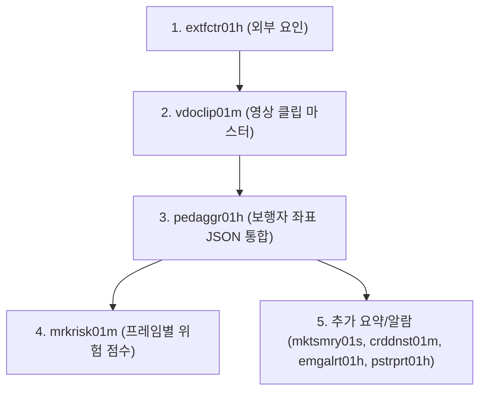

# 🚀 CCTV AI 파이프라인 - Supabase 백엔드 데이터 연동 명세서 (BACKEND.md)

본 문서는 CCTV AI 파이프라인에서 추출한 객체 추적, BEV 물리 좌표, 밀집도 및 위험 점수 데이터를 **Supabase 데이터베이스(PostgreSQL)**로 전송할 때의 **적재 순서(외래키 의존성), 테이블 명세, 컬럼 속성 및 로컬 파일 저장 위치**를 정리한 표준 명세서입니다.

---

## 📌 1. 백엔드 DB 적재 순서 (Pipeline Order)

외래키(FK) 참조 제약 조건을 만족하기 위해 **반드시 아래 순서대로 DB에 INSERT**되어야 합니다.



| 순서 | 테이블 명 | 한글 명칭 | 역할 및 의존성 (FK) |
| :---: | :--- | :--- | :--- |
| **1** | `extfctr01h` | 외부 요인 이력 | 날씨, 기온, 행사 정보 (기본 `factor_id=1` 등록) |
| **2** | `vdoclip01m` | CCTV 영상 클립 | 원본/분석 클립 S3 URL 관리 (FK: `factor_id`) |
| **3** | `pedaggr01h` | 보행자 좌표 통합 ⭐ | 2D 픽셀 & 3D BEV 좌표 JSON 적재 (FK: `clip_id`) |
| **4** | `mrkrisk01m` | 위험 점수 ⭐ | 프레임별 AI 위험 점수 & 등급 적재 (FK: `coord_id` ➔ `pedaggr01h.coord_id`) |
| **5** | `mktsmry01s` | 시장 통계 요약 | 종합 밀집도 및 최고 위험도 요약 |
| **5** | `crddnst01m` / `h` | 인구 밀집도 현황/로그 | 구역별 순간 방문자 수 및 밀집도 스코어 |
| **5** | `emgalrt01h` | 긴급 알람 이력 | 위험 임계치 초과 시 긴급 알람/신고 기록 |
| **5** | `pstrprt01h` | 사후 분석 보고서 | LLM 생성 사후 요약문 및 PDF S3 URL |

---

## 📂 2. 테이블별 상세 명세 & 로컬 파일 저장 위치

### 1) `pedaggr01h` (CCTV 보행자 좌표 이력 - AI 핵심 ⭐)
* **설명**: 프레임 단위로 추출된 보행자들의 2D 픽셀 좌표 및 3D BEV 좌표를 JSONb 형태로 저장합니다.
* **로컬 파일 저장 위치**:
  * 📄 **CSV**: [results/pedaggr01h_aggregated.csv](file:///e:/AIVLE_10team/ai_pipeline/results/pedaggr01h_aggregated.csv) (또는 `pedaggr01h_aggregated_latest.csv`)
  * 📄 **JSON**: [results/pedaggr01h_full_dataset.json](file:///e:/AIVLE_10team/ai_pipeline/results/pedaggr01h_full_dataset.json)
  * 📄 **개별 JSON**: [results/pedestrian_pixels_by_frame.json](file:///e:/AIVLE_10team/ai_pipeline/results/pedestrian_pixels_by_frame.json), [results/pedestrian_bev_xyz_by_frame.json](file:///e:/AIVLE_10team/ai_pipeline/results/pedestrian_bev_xyz_by_frame.json)

| 컬럼명 | DB 자료형 | NULL | PK/FK | 설명 및 적재 예시 |
| :--- | :--- | :---: | :---: | :--- |
| `coord_id` | `int8` | ❌ | **PK** | 좌표 고유 식별자 (DB 자동생성/Identity) |
| `clip_id` | `int8` | ❌ | **FK** | 참조 영상 클립 번호 (`vdoclip01m.clip_id`) |
| `frame_id` | `int4` | ❌ | - | 영상 내 프레임 번호 (예: `125`) |
| `video_id` | `int4` | ⭕ | - | 원본 영상 ID (기본값: `1`) |
| `pixels_json` | `jsonb` | ⭕ | - | 2D 픽셀 좌표 (`{"person_1": {"x": 359.0, "y": 37.0}}`) |
| `bev_xyz_json` | `jsonb` | ⭕ | - | 3D BEV 물리 좌표 (`{"person_1": {"x": 12.5, "y": 5.2, "z": 0.0}}`) |
| `captured_at` | `timestamp`| ❌ | - | 해당 프레임 캡처 시각 (ISO 8601 문자열) |

---

### 2) `mrkrisk01m` (위험 점수 - AI 핵심 ⭐)
* **설명**: 프레임별 보행자 밀집 수량 및 AI 위험도 스코어를 저장합니다. `pedaggr01h` 적재 후 생기는 `coord_id`를 외래키로 참조합니다.
* **로컬 파일 저장 위치**:
  * 📄 **CSV**: [results/pedaggr01h_aggregated.csv](file:///e:/AIVLE_10team/ai_pipeline/results/pedaggr01h_aggregated.csv) (적재 시 자동 연산 후 DB 입력)
  * 📄 **요약 CSV**: [results/cctv_multidimensional_summary.csv](file:///e:/AIVLE_10team/ai_pipeline/results/cctv_multidimensional_summary.csv)

| 컬럼명 | DB 자료형 | NULL | PK/FK | 설명 및 적재 예시 |
| :--- | :--- | :---: | :---: | :--- |
| `risk_id` | `int8` | ❌ | **PK** | 위험도 고유 식별자 (DB 자동생성) |
| `coord_id` | `int8` | ❌ | **FK** | 연관된 `pedaggr01h.coord_id` |
| `risk_score` | `float4` | ❌ | - | AI 위험 점수 (`0.0` ~ `100.0`) |
| `risk_level` | `varchar` | ❌ | - | 위험 등급 (`"SAFE"`, `"WARN"`, `"HIGH"`) |
| `reason_code` | `varchar` | ❌ | - | 탐지 사유 (`"NORMAL"`, `"CROWD_DENSITY_HIGH"`) |
| `total_count` | `int4` | ❌ | - | 해당 프레임 감지 인원 수 (예: `15`) |
| `detected_at` | `timestamp`| ❌ | - | 위험 탐지 시각 |

---

### 3) `vdoclip01m` (CCTV 영상 업로드/클립 관리)
* **설명**: 분석 대상 영상 클립 정보 및 S3 URL 경로를 관리합니다.
* **로컬 파일 저장 위치**: S3 업로드 파이프라인 (`sensor_fusion_archive/utils/s3_uploader.py`) 연동

| 컬럼명 | DB 자료형 | NULL | PK/FK | 설명 및 적재 예시 |
| :--- | :--- | :---: | :---: | :--- |
| `clip_id` | `int8` | ❌ | **PK** | 클립 고유 ID (기본값: `1`) |
| `zone_id` | `int8` | ❌ | **FK** | 관제 구역 ID |
| `factor_id` | `int8` | ⭕ | **FK** | 연관 외부 요인 ID (`extfctr01h.factor_id`) |
| `clip_type` | `varchar` | ❌ | - | 클립 구별 (`"LIVE"`, `"TEMP"`, `"RISK"`) |
| `s3_clip_url` | `text` | ❌ | - | AWS S3 업로드 URL |
| `start_time` | `timestamp`| ❌ | - | 영상 시작 시각 |
| `end_time` | `timestamp`| ❌ | - | 영상 종료 시각 |
| `expires_at` | `timestamp`| ❌ | - | 클립 파기 예정 시각 |
| `is_downloaded`| `bool` | ❌ | - | 다운로드 여부 (`false`) |
| `is_deleted` | `bool` | ❌ | - | 삭제 여부 (`false`) |

---

### 4) `extfctr01h` (CCTV 분석 외부 요인)
* **설명**: 기상 상태, 온습도, 이벤트 등 외부 요인 데이터
* **로컬 파일 저장 위치**: [results/cctv_multidimensional_summary.csv](file:///e:/AIVLE_10team/ai_pipeline/results/cctv_multidimensional_summary.csv)

| 컬럼명 | DB 자료형 | NULL | PK/FK | 설명 및 적재 예시 |
| :--- | :--- | :---: | :---: | :--- |
| `factor_id` | `int8` | ❌ | **PK** | 외부 요인 고유 ID (기본값: `1`) |
| `market_id` | `int8` | ❌ | **FK** | 시장 ID (망원시장: `1`) |
| `video_id` | `int4` | ⭕ | - | 비디오 ID |
| `target_date` | `date` | ❌ | - | 적용 날짜 (`YYYY-MM-DD`) |
| `weather_condition` | `varchar` | ⭕ | - | 기상 상태 (`"CLEAR"`, `"RAIN"`, `"SUMMER"`) |
| `temperature` | `numeric` | ⭕ | - | 섭씨 기온 (예: `25.4`) |
| `event_category` | `varchar` | ⭕ | - | 행사 카테고리 (`"NORMAL"`, `"FESTIVAL"`) |
| `updated_at` | `timestamp`| ❌ | - | 갱신 시각 |

---

### 5) `mktsmry01s` (시장 통계 요약)
* **설명**: 프레임/시간대별 시장 전체 종합 밀집도 및 위험도 요약 데이터
* **로컬 파일 저장 위치**: [results/cctv_multidimensional_summary.csv](file:///e:/AIVLE_10team/ai_pipeline/results/cctv_multidimensional_summary.csv)

| 컬럼명 | DB 자료형 | 설명 |
| :--- | :--- | :--- |
| `summary_id` | `int8` (PK) | 요약 ID (자동 생성) |
| `market_id` | `int8` (FK) | 시장 ID (`1`) |
| `frame_id` | `int4` | 프레임 번호 |
| `total_cctv_count` | `int4` | 작동 중인 CCTV 수 |
| `avg_density_score` | `float4` | 평균 밀집도 스코어 |
| `max_density_score` | `float4` | 최고 밀집도 스코어 |
| `max_risk_score` | `float4` | 최고 위험 점수 |
| `analysis_mode` | `varchar` | 분석 모드 (`"LIVE"`) |
| `video_id` | `int4` | 비디오 ID |

---

### 6) `crddnst01m` / `crddnst01h` (인구 밀집도 현황 및 로그)
* **설명**: 특정 구역(Zone)별 실시간 방문자 수 및 밀집 상태
* **로컬 파일 저장 위치**: [results/cctv_multidimensional_summary.csv](file:///e:/AIVLE_10team/ai_pipeline/results/cctv_multidimensional_summary.csv)

| 컬럼명 | DB 자료형 | 설명 |
| :--- | :--- | :--- |
| `zone_id` / `crowd_density_id` | `int8` | 구역 ID |
| `visitor_count` | `int4` | 구간 내 감지 인원 수 |
| `density_score` | `float4` | 밀집도 스코어 |
| `status_level` | `varchar` | 상태 등급 (`"NORMAL"`, `"WARN"`, `"DANGER"`) |
| `analysis_mode` | `varchar` | 분석 모드 (`"LIVE"`) |
| `video_id` / `frame_id` | `int4` | 비디오 및 프레임 번호 |
| `captured_at` | `timestamp` | 측정 시각 |

---

### 7) `emgalrt01h` (CCTV 긴급 알람 이력)
* **설명**: 고위험 감지 시 자동 발생 신고 기록
* **컬럼**: `alert_id` (PK), `zone_id` (FK), `risk_id` (FK), `alert_type` (`"HIGH_RISK_SURGE"`), `s3_clip_url`, `is_resolved` (`false`), `alerted_at`

---

### 8) `pstrprt01h` (사후 분석 LLM 보고서)
* **설명**: 긴급 상황 발생 후 LLM 모델이 자동 생성하는 보고서
* **컬럼**: `report_id` (PK), `alert_id` (FK), `video_id`, `target_date`, `llm_summary`, `s3_pdf_url`, `created_at`

---

## 🛠️ 3. Python DB 적재 모듈 실행 안내
* **적재 모듈 파일**: [cctv_ai_pipeline/sensor_fusion_archive/utils/db_connector.py](file:///e:/AIVLE_10team/ai_pipeline/cctv_ai_pipeline/sensor_fusion_archive/utils/db_connector.py)
* **적재 파이프라인**: [cctv_ai_pipeline/09_aggregate_pedestrian_json.py](file:///e:/AIVLE_10team/ai_pipeline/cctv_ai_pipeline/09_aggregate_pedestrian_json.py)

```bash
# 파이프라인 실행 시 로컬 results/ 저장과 동시에 Supabase DB에 자동으로 상기 순서로 적재됩니다.
python ai_pipeline/cctv_ai_pipeline/09_aggregate_pedestrian_json.py
```
