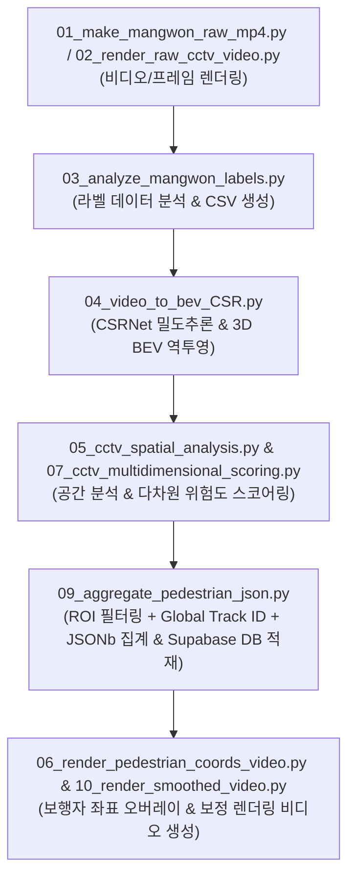

# 🎥 CCTV AI 파이프라인 명세서 (PIPELINE.md)

본 문서는 CCTV 프레임 수집부터 객체 추적, BEV(Bird's Eye View) 3D 공간 변환, 다차원 위험도 스코어링, 비디오 시각화 렌더링 및 **Supabase 백엔드 데이터베이스 적재**까지 전체 CCTV AI 파이프라인의 **단계별 실행 순서, 주요 스크립트 역할, 입출력 파일 및 데이터 흐름**을 명세합니다.

---

## 🔄 1. 파이프라인 실행 전체 구조 (Pipeline Architecture)

CCTV AI 파이프라인은 데이터 수집/전처리부터 AI 추론, 공간 투영, 집계 및 백엔드 적재까지 **단계별 파이프라인 구조**로 구성되어 있습니다.



---

## 📜 2. 단계별 상세 스크립트 명세

| 단계 | 스크립트 파일명 | 역할 및 주요 기능 | 입력 파일 (Input) | 출력 파일 (Output) |
| :---: | :--- | :--- | :--- | :--- |
| **00** | [00_run_cctv_only_pipeline.py](file:///e:/AIVLE_10team/ai_pipeline/cctv_ai_pipeline/00_run_cctv_only_pipeline.py) | CCTV 전용 독립 파이프라인 순차 자동 실행 메인 통합 스크립트 | - | 전체 파이프라인 결과물 자동 생성 |
| **01** | [01_make_mangwon_raw_mp4.py](file:///e:/AIVLE_10team/ai_pipeline/cctv_ai_pipeline/01_make_mangwon_raw_mp4.py) | 이미지 프레임 및 라벨 데이터로부터 원본 CCTV MP4 영상 생성 | 프레임 이미지 폴더 | `results/cctv_mangwon_raw_video.mp4` |
| **02** | [02_render_raw_cctv_video.py](file:///e:/AIVLE_10team/ai_pipeline/cctv_ai_pipeline/02_render_raw_cctv_video.py) | 원본 CCTV MP4 비디오 렌더링 및 해상도/FPS 규격 맞춤 | MP4 / 프레임 | `results/cctv_raw_video.mp4` |
| **03** | [03_analyze_mangwon_labels.py](file:///e:/AIVLE_10team/ai_pipeline/cctv_ai_pipeline/03_analyze_mangwon_labels.py) | 망원시장 CCTV 보행자 바운딩 박스 라벨 추출 및 좌표 정제 | Ground Truth 라벨 | `results/mangwon_label_pedestrians.csv` |
| **04** | [04_video_to_bev_CSR.py](file:///e:/AIVLE_10team/ai_pipeline/cctv_ai_pipeline/04_video_to_bev_CSR.py) | CSRNet 인원 밀집도 추론 및 Homography Matrix 기반 BEV 2D/3D 좌표 역투영 변환 | 영상 / 라벨 CSV | `results/cctv_bev_coordinates.csv` |
| **05** | [05_cctv_spatial_analysis.py](file:///e:/AIVLE_10team/ai_pipeline/cctv_ai_pipeline/05_cctv_spatial_analysis.py) | CCTV 단독 공간 분석, 구역별 혼잡도 및 다차원 요약 데이터 산출 | BEV 좌표 CSV | `results/cctv_multidimensional_summary.csv` |
| **06** | [06_render_pedestrian_coords_video.py](file:///e:/AIVLE_10team/ai_pipeline/cctv_ai_pipeline/06_render_pedestrian_coords_video.py) | CCTV 영상 위에 보행자 바운딩 박스 및 실시간 3D BEV 좌표 시각화 오버레이 렌더링 | MP4 / 보행자 CSV | `results/cctv_real_video_coords_overlay.mp4` |
| **07** | [07_cctv_multidimensional_scoring.py](file:///e:/AIVLE_10team/ai_pipeline/cctv_ai_pipeline/07_cctv_multidimensional_scoring.py) | 기상청 30분 초단기예보 연동 및 출입구 유입량 2배 급증(`RAIN_PREDICTION_INFLOW_SPIKE`) 다차원 위험도 관제 | 외부요인 API / CSV | `results/cctv_multidimensional_summary_*.csv`<br>`results/cctv_spatial_analysis_movie_*.mp4` |
| **08** | [08_schema_ddl.sql](file:///e:/AIVLE_10team/ai_pipeline/cctv_ai_pipeline/08_schema_ddl.sql) | Supabase PostgreSQL 데이터베이스 스키마 및 DDL SQL 구문 | - | DB 스키마 쿼리 정의 |
| **09** | [09_aggregate_pedestrian_json.py](file:///e:/AIVLE_10team/ai_pipeline/cctv_ai_pipeline/09_aggregate_pedestrian_json.py) | **[핵심⭐]** ROI 구역 필터링, Global Track ID 부여, 30분 예후 기상 가중치 연동, 2D/3D JSONb 집계 및 Supabase DB (`pedaggr01h`, `mrkrisk01m`, `extfctr01h`) 자동 연쇄 적재 | `mangwon_label_pedestrians.csv` | `results/pedaggr01h_aggregated.csv`<br>`results/pedaggr01h_full_dataset.json`<br>Supabase DB 적재 |
| **10** | [10_render_smoothed_video.py](file:///e:/AIVLE_10team/ai_pipeline/cctv_ai_pipeline/10_render_smoothed_video.py) | 튐 현상 보정(EMA/Kalman Filter) 적용 및 최종 대시보드 시뮬레이션 비디오 렌더링 | 3D BEV JSON/CSV | `results/cctv_smoothed_simulation_video.mp4`<br>`results/cctv_simulation_dashboard.html` |
| **11** | [api_server.py](file:///e:/AIVLE_10team/ai_pipeline/cctv_ai_pipeline/api_server.py) | **[FastAPI 서버⭐]** 실시간 업로드/WebSocket 관제 스트리밍 서버. 원본 프레임 AI 추론 선행 후, YOLOv8 기반의 보행자 모자이크 비식별화를 적용한 결과 비디오 자동 가공 및 서빙. 호모그래피 BEV 물리 좌표 역투영 및 센트로이드 트래커(CentroidTracker) 연동을 통한 실제 보행 물리 속도($m/s$) 실측 및 현실적인 정체 지연 시간(`stagnation_sec`) 분석 기능 내장 | 업로드 MP4 비디오 | `results/cctv_simulation_video.mp4`<br>`results/uploaded_*_dataset.json` |
| **12** | [generate_anonymized_monitor.py](file:///e:/AIVLE_10team/ai_pipeline/cctv_ai_pipeline/generate_anonymized_monitor.py) | YOLOv8 모자이크 바운딩 박스 및 CSRNet Convex Hull 다각형 오버레이 비식별화 영상 생성 배치 모듈 | 입력 비디오 | `heatmap/anonymized/monitor*.mp4` |
| **13** | [generate_fast_monitor.py](file:///e:/AIVLE_10team/ai_pipeline/generate_fast_monitor.py) | 초경량 YOLOv8n, 스킵 인터벌 5, 960x540 CSRNet 해상도 스케일링이 통합된 가속 비식별화 테스트 배치 모듈 | 입력 비디오 | `results/monitor_fast_*.mp4` |
| **14** | [generate_heatmaps.py](file:///e:/AIVLE_10team/ai_pipeline/generate_heatmaps.py) | CSRNet 밀집 히트맵, YOLOv8 가우시안 히트맵, 두 모델 퓨전 히트맵 3종 생성 배치 모듈 | 입력 비디오 | `heatmap/csrnet*.mp4`<br>`heatmap/yolo*.mp4`<br>`heatmap/csryo*.mp4` |
| **15** | [generate_dots.py](file:///e:/AIVLE_10team/ai_pipeline/generate_dots.py) | CSRNet 극대점(Peak) 검출 기반 2D 바둑알 도트 및 위험 구역 다각형 오버레이 시각화 생성 배치 모듈 | 입력 비디오 | `heatmap/csrdots/csrdots*.mp4` |

---

## 🧩 3. 보조 모듈 및 아카이브 (Helper Modules)

* **[weather_api.py](file:///e:/AIVLE_10team/ai_pipeline/cctv_ai_pipeline/weather_api.py)**: 기상청 단기예보 및 과거 날씨 API를 조회하여 기온, 강수량 등 외부 환경 요인 데이터를 파이프라인으로 수집합니다.
* **[risk_validation_engine.py](file:///e:/AIVLE_10team/ai_pipeline/cctv_ai_pipeline/risk_validation_engine.py)**: 보행자 밀집도 및 위험 점수 산정 임계치를 검증하는 유효성 검사 엔진입니다.
* **[sensor_fusion_archive/utils/db_connector.py](file:///e:/AIVLE_10team/ai_pipeline/cctv_ai_pipeline/sensor_fusion_archive/utils/db_connector.py)**: Supabase PostgreSQL 접속 커넥터 및 `pedaggr01h`, `mrkrisk01m`, `vdoclip01m`, `extfctr01h` 등 백엔드 일괄 적재(Bulk Insert) 함수 모듈입니다.
* **[sensor_fusion_archive/utils/s3_uploader.py](file:///e:/AIVLE_10team/ai_pipeline/cctv_ai_pipeline/sensor_fusion_archive/utils/s3_uploader.py)**: 생성된 결과 MP4 비디오 및 CSV 아카이브 Zip을 AWS S3 클라우드에 업로드하는 모듈입니다.

---

## 🗃️ 4. 결과 파일 및 프론트엔드 대시보드 연동 (Artifacts & Frontend)

파이프라인 실행 결과물은 모두 `results/` 디렉토리에 저장되며, 모듈화된 대시보드([dashboard/index.html](file:///e:/AIVLE_10team/dashboard/index.html))에 **100% 순수 감지 데이터**로 실시간 연동됩니다.

* **최종 CSV 데이터**:
  * [pedaggr01h_aggregated.csv](file:///e:/AIVLE_10team/results/pedaggr01h_aggregated.csv) *(Supabase pedaggr01h 연동)*
  * [cctv_multidimensional_summary.csv](file:///e:/AIVLE_10team/results/cctv_multidimensional_summary.csv) *(다차원 스코어링)*
  * [mangwon_label_pedestrians.csv](file:///e:/AIVLE_10team/results/mangwon_label_pedestrians.csv) *(보행자 라벨)*
* **최종 JSON 데이터**:
  * [pedaggr01h_full_dataset.json](file:///e:/AIVLE_10team/results/pedaggr01h_full_dataset.json) *(대시보드 실시간 연동 원본 데이터)*
  * [pedestrian_pixels_by_frame.json](file:///e:/AIVLE_10team/results/pedestrian_pixels_by_frame.json)
  * [pedestrian_bev_xyz_by_frame.json](file:///e:/AIVLE_10team/results/pedestrian_bev_xyz_by_frame.json)
  * [pedestrian_trajectories_by_id.json](file:///e:/AIVLE_10team/results/pedestrian_trajectories_by_id.json)
* **모듈화 프론트엔드 대시보드**:
  * [dashboard/index.html](file:///e:/AIVLE_10team/dashboard/index.html) *(구조)*
  * [dashboard/css/styles.css](file:///e:/AIVLE_10team/dashboard/css/styles.css) *(스타일/테마)*
  * [dashboard/js/dashboard.js](file:///e:/AIVLE_10team/dashboard/js/dashboard.js) *(순수 실시간 데이터 제어 & 수동 슬라이더 튜닝)*


---

## 🚀 5. 파이프라인 실행 방법

### 메인 원클릭 파이프라인 실행
```bash
python ai_pipeline/cctv_ai_pipeline/00_run_cctv_only_pipeline.py
```

### 개별 집계 및 DB 적재 파이프라인만 실행
```bash
python ai_pipeline/cctv_ai_pipeline/09_aggregate_pedestrian_json.py
```
