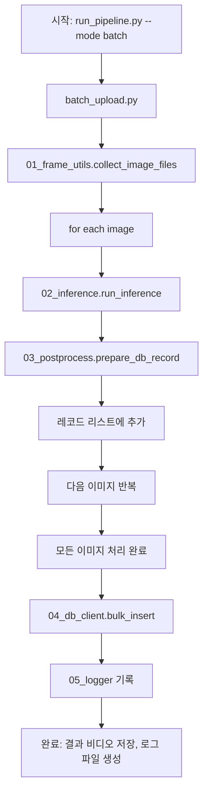

# 📥 업로드 파이프라인 흐름

## 1️⃣ 핵심 파일 순서 (core/)
| 번호 | 파일명 | 역할 |
|------|---------|------|
| **01** | `01_frame_utils.py` | 한글 경로 이미지 읽기, 프레임 정렬, RTSP 스트림 캡처 헬퍼 |
| **02** | `02_inference.py` | CSRNet 모델 로드 및 `run_inference(frame)` 엔트리 포인트 제공 |
| **03** | `03_postprocess.py` | 밀도 맵 → 보행자 수, BEV 좌표 변환, DB 레코드 생성 |
| **04** | `04_db_client.py` | Supabase 클라이언트 – `bulk_insert(records)` / `async_insert(record)` |
| **05** | `05_logger.py`   | 파이프라인 전반 로그 (JSONL) 기록 |

> **Tip**: 파일 번호는 import 순서를 의미합니다. `batch_upload.py` 가 위 순서대로 모듈을 불러와 전체 흐름을 구성합니다.

---

## 2️⃣ 업로드(배치) 파이프라인 전체 흐름


### 단계별 설명
1. **시작** – `run_pipeline.py` 로 `--mode batch` 플래그를 전달하면 `batch_upload.py` 가 실행됩니다.
2. **프레임 수집** – `01_frame_utils.collect_image_files()` 가 `config.yaml` 에 지정된 `raw_dir` 에서 `*.jpg` 파일을 **프레임 번호 순**으로 정렬해 반환합니다.
3. **프레임 순회** – 이미지 리스트를 순차적으로 읽고 `cv2_imread_korean` 로 BGR 이미지 객체를 얻습니다.
4. **AI 추론** – `02_inference.run_inference(frame)` 가 CSRNet 모델을 이용해 **밀도 맵**(density map) 텐서를 반환합니다.
5. **후처리** – `03_postprocess.prepare_db_record` 가
   - `density_to_count` 로 보행자 수를 추정
   - `generate_bev_points` 로 BEV 좌표(점) 리스트 생성
   - `frame_id`, `timestamp`, `ped_count`, `bev_points` 를 포함하는 **DB 레코드**를 만든다.
6. **레코드 누적** – 모든 프레임에 대해 레코드를 `records` 리스트에 누적합니다.
7. **DB 일괄 삽입** – `04_db_client.bulk_insert(records)` 가 Supabase `pedaggr01h` 테이블에 **한 번**에 1,571 건을 삽입합니다.
8. **로그 기록** – `05_logger` 가 전체 프레임 수, 평균 GPU FPS, DB 삽입 시간 등을 `pipeline_log.jsonl` 로 남깁니다.
9. **완료** – `batch_upload.py` 가 옵션에 따라 **결과 비디오**(`cctv_mangwon_raw_video.mp4`) 를 저장하고, 최종 보고서를 `walkthrough.md` 로 업데이트합니다.

---

## 3️⃣ 핵심 설정 (`config.yaml`)
```yaml
pipeline_mode: batch
batch:
  raw_dir: E:\\test\\cctv_망원시장      # 원본 이미지 폴더
  output_video: results/cctv_mangwon_raw_video.mp4
```

## 4️⃣ 실행 방법
```bash
# 배치(업로드) 모드
python run_pipeline.py --mode batch
```
위 명령을 실행하면 위 흐름대로 자동으로 진행됩니다.

---

## 5️⃣ 참고 사항
- **프레임 순서 보장**: `collect_image_files` 에서 `get_frame_num` 로 파일명을 숫자화해 정확한 시간 순서를 유지합니다.
- **GPU 메모리 관리**: `02_inference.py` 는 한 번에 하나의 프레임만 GPU에 올리므로 `max_workers=1` 로도 OOM 없이 동작합니다.
- **확장성**: 실시간 스트리밍(`realtime_stream.py`) 은 동일한 `01~03` 모듈을 재사용하고, DB 삽입만 `async_insert` 로 교체하면 됩니다.

---

**이 문서는 업로드(배치) 파이프라인을 한눈에 파악하고, 필요 시 코드를 그대로 재사용하거나 확장하는 데 도움이 되도록 설계되었습니다.**
